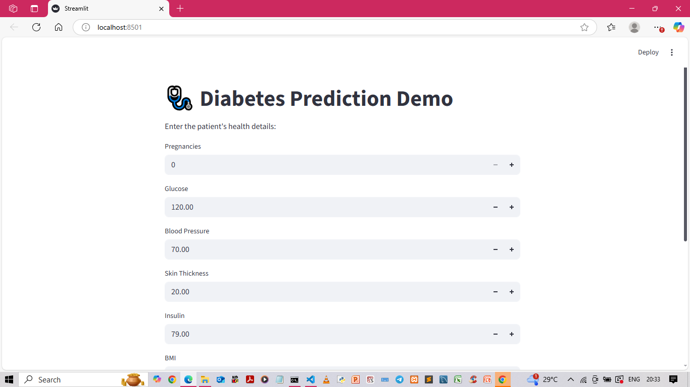
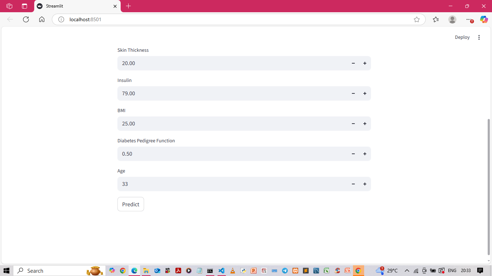
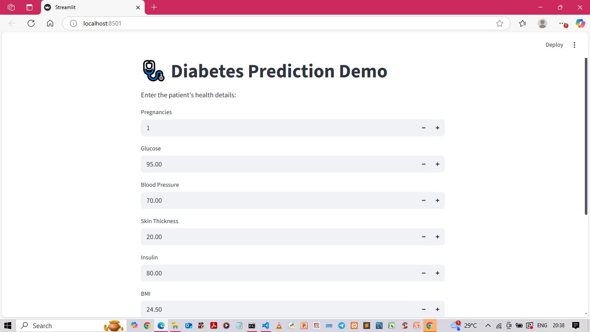
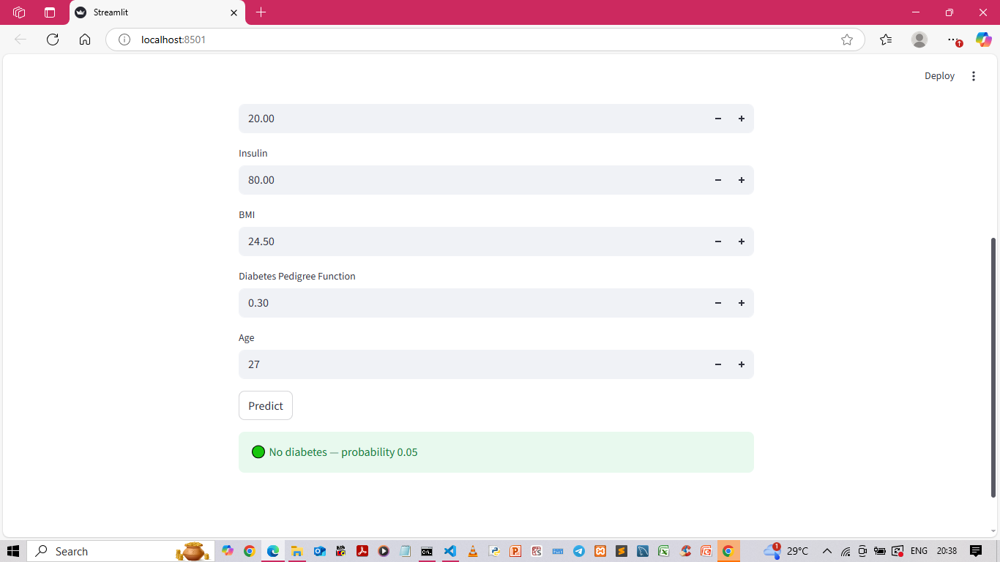
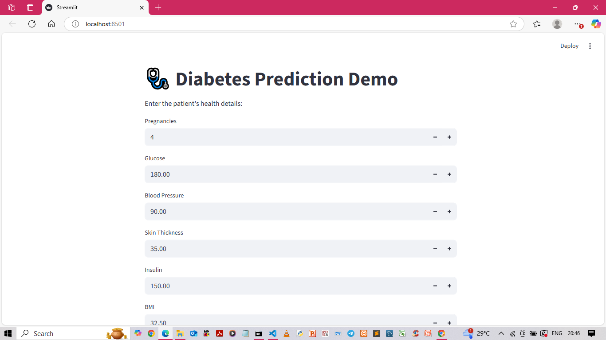
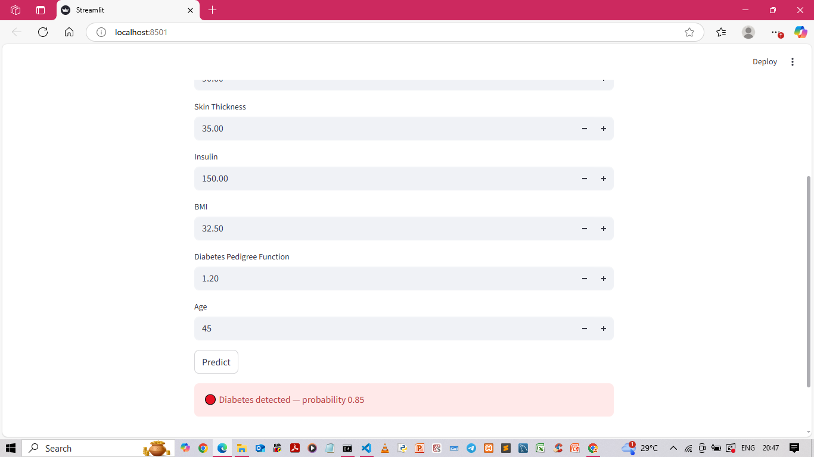

# 🩺 Diabetes Prediction using Machine Learning

## 📚 Table of Contents
- [About the Project](#-about-the-project)
- [Tech Stack](#-tech-stack)
- [Features](#-features)
- [Dataset](#-dataset)
- [Model Accuracy](#-model-accuracy)
- [Project Screenshots](#-project-screenshots)
- [Future Improvements](#-future-improvements)

## 💡 About the Project
The Diabetes Prediction using Machine Learning project aims to predict if a person is diabetic based on major medical diagnostic factors such as glucose level, BMI, insulin, age, and blood pressure. Early prediction enables timely medical action and better health management. The study uses supervised learning techniques, specifically Logistic Regression, to categorize patients as diabetes or non-diabetic. The model was trained using the Pima Indians Diabetes Dataset, a well-known dataset in the healthcare field.

This research shows how AI may be used in healthcare to help with early detection and awareness by merging Streamlit and Machine Learning.

## 🛠️ Tech Stack

## ✨ Features
- 🩺 User-friendly Streamlit web interface
- 📊 Input fields for key health parameters
- 🤖 Machine Learning–based diabetes prediction
- 📈 Displays prediction result instantly
- 💾 Model trained on real-world medical dataset
- 🧠 Accurate and explainable predictions

## 📊 Dataset
The dataset is taken from the PIMA Indians Diabetes Database available on Kaggle.  
It includes parameters like:
- Pregnancies
- Glucose
- Blood Pressure
- BMI
- Age
- Outcome (1 = Diabetic, 0 = Non-Diabetic)

## 📈 Model Accuracy
Achieved 92% accuracy in predicting diabetes using Random Forest and Logistic Regression Models.

## 🖼️ Project Screenshots

## 🚀 Future Improvements
- Add user authentication  
- Deploy on cloud (Heroku / AWS)  
- Add real-time health data input  
- Improve UI using HTML/CSS
